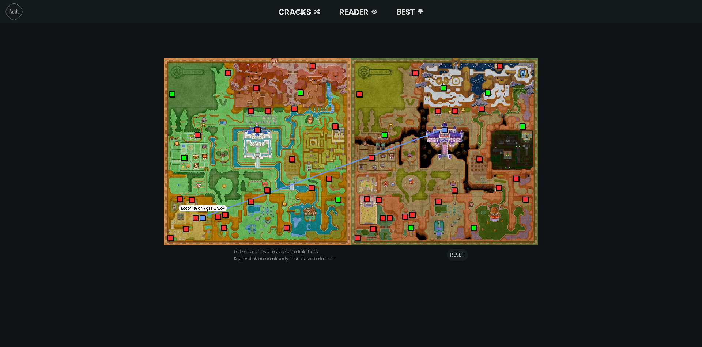
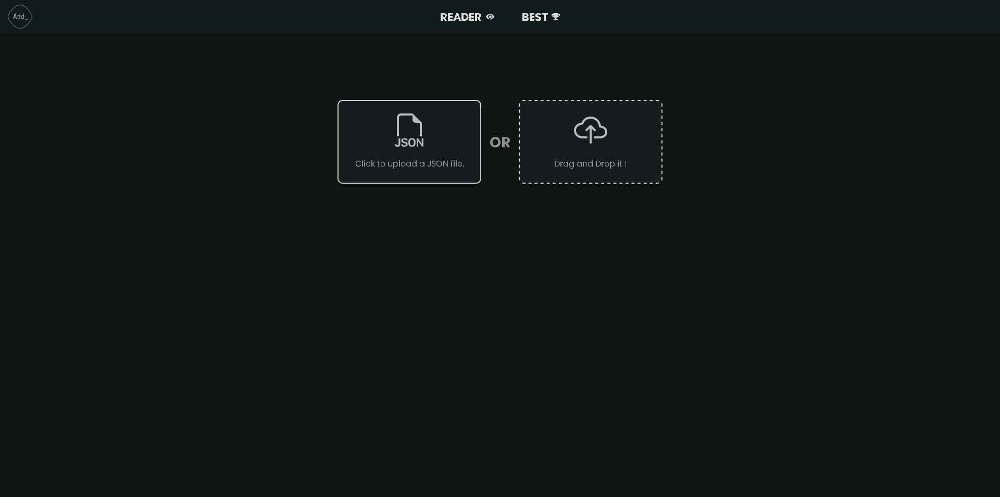
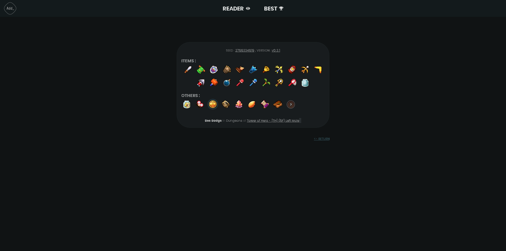
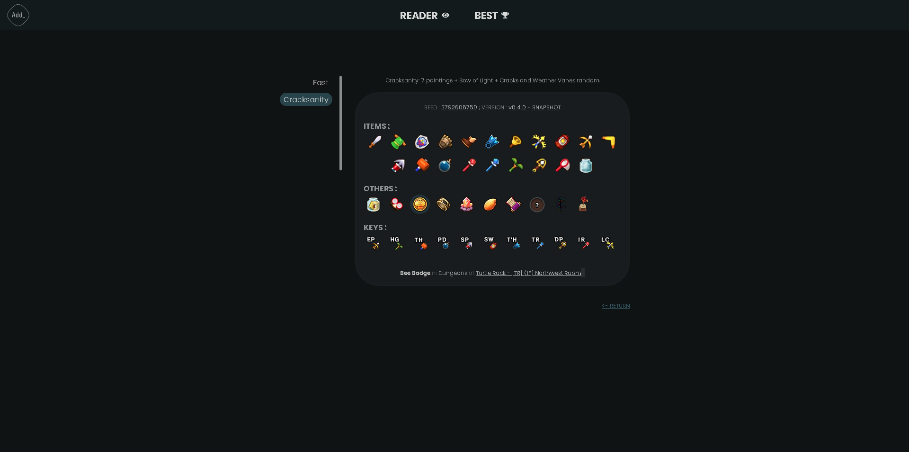

  
  
  <a href="https://firedrox.github.io/albw/">
    <h3 align="center">ALBW Spoilers Logs Reader 📄</h3>
  </a>

 

<ol>
  <li>
    <a href="#features">Features</a>
    <ul>
      <li><a href="#cracks">Cracks</a></li>
      <li><a href="#reader">Reader</a></li>
      <li><a href="#best">Best runs</a></li>
    </ul>
  </li>
</ol>

 

[![React][React.js]][React-url]
[![contributors][contributors-shield]][contributors-url]
[![stars][stars-icon]][stars-url]
[![Discord][discord-icon]][discord-url]

> [!WARNING]
> This is a personal project! It is designed to work with version 0.3.1 and 0.4.0 of the [Rick Fay Randomizer](https://github.com/rickfay/z17-randomizer/tree/master) but may not be compatible with older versions.

## Features

---

### Cracks

Left-click on two red boxes to link them. Right-click on an already linked box to delete it.

  

 

(<a href="#readme-top">Top of the page</a>)

---

### Reader

Upload your own spoiler log file locally to the webpage to read it.

  

(<a href="#readme-top">Top of the page</a>)

---

### Best

Check out my top runs, all completed using one of the preset listed at the left. You can also view the spoiler logs!

  

 

(<a href="#readme-top">Top of the page</a>)

---

[React.js]: https://img.shields.io/badge/React-20232A?style=for-the-badge&logo=react&logoColor=61DAFB&colorB=555
[React-url]: https://react.dev/
[contributors-shield]: https://img.shields.io/github/contributors/firedrox/albw.svg?style=for-the-badge
[contributors-url]: https://github.com/FireDroX/albw/graphs/contributors
[stars-icon]: https://img.shields.io/github/stars/firedrox/albw.svg?style=for-the-badge
[stars-url]: https://github.com/FireDroX/albw/stargazers
[discord-icon]: https://img.shields.io/badge/Discord-5865F2?style=for-the-badge&logo=discord&colorB=555
[discord-url]: https://discord.gg/Zmmqd9Tbnn
